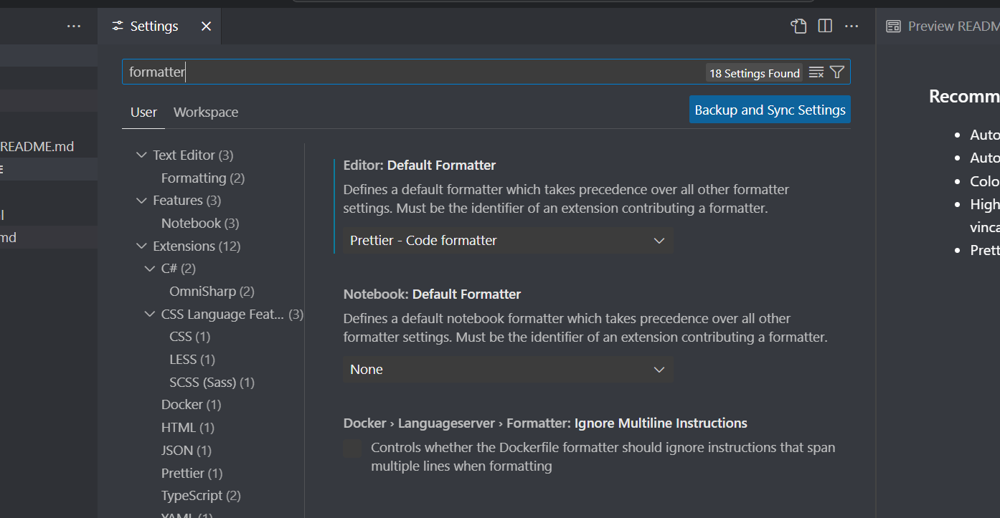
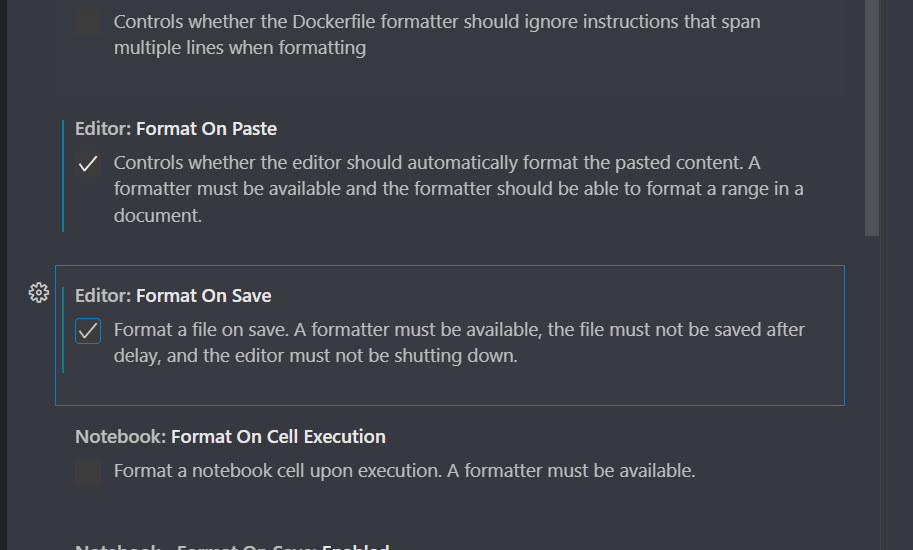
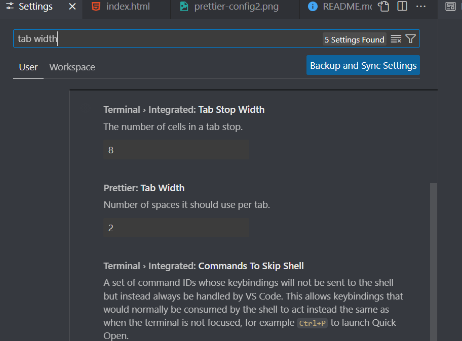
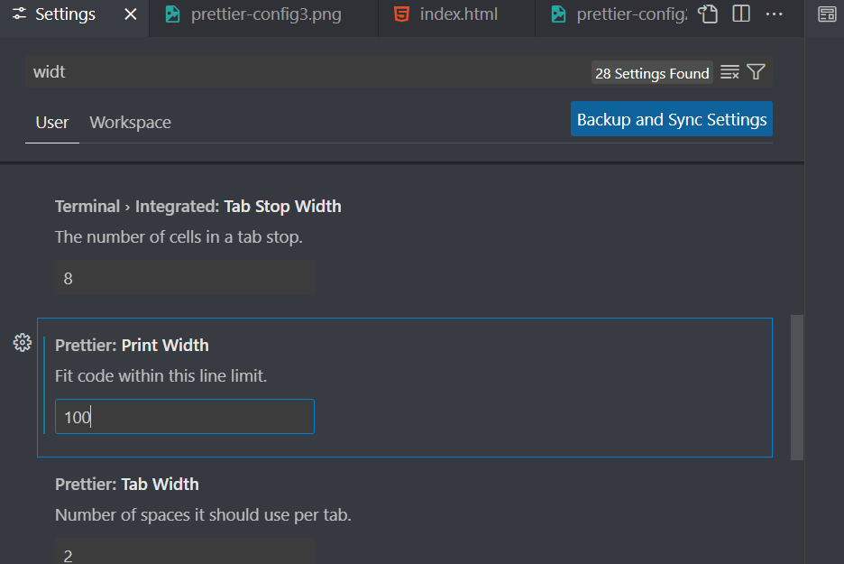

### Recommended extensions

- Auto Close Tag, Jun Han
- Auto Rename Tag, Jun Han
- Colorize, kamikillerto
- Highlight Matching Tag - vincaslt
- Prettier - Code formatter

#### How to configure Prettier in your VSC

1. Go to settings and search for `formatter`.

<figure></figure>

2. In the dropdown on "Default Formatter", choose `Prettier - Code formatter` _( esbenp.. )_

3. Check the boxes on "Format On Paste" and "Format On Save"

<figure></figure>

4. Next, set the tab width. I recommend 2!

<figure></figure>

5. Finally, set the print width of your editor to 100 characters.

<figure></figure>
